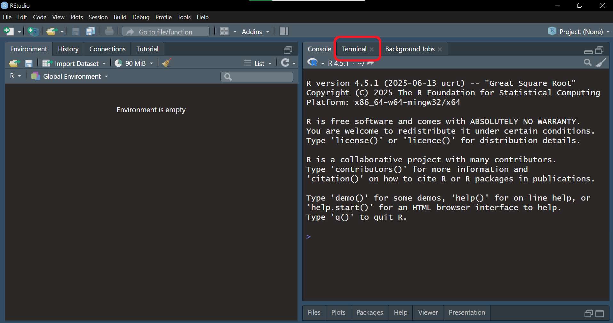
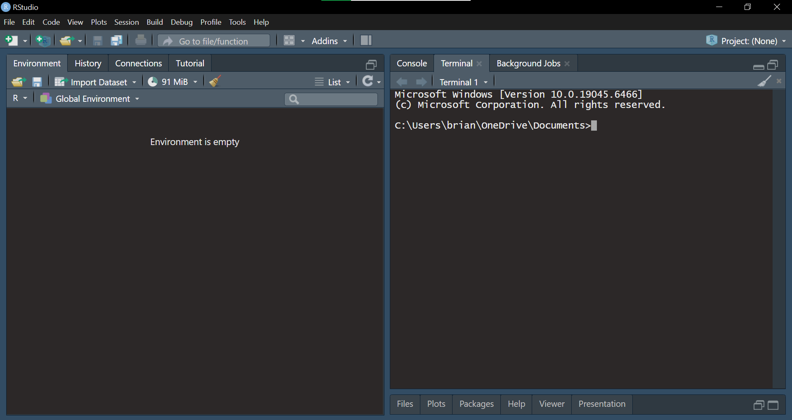
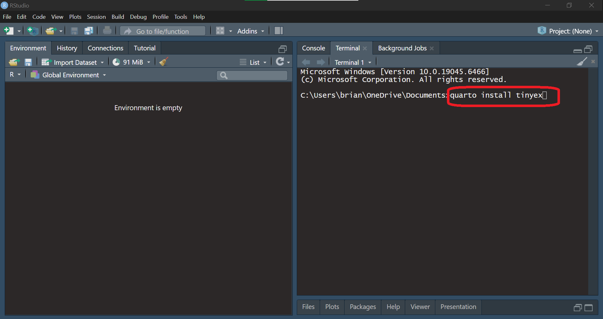
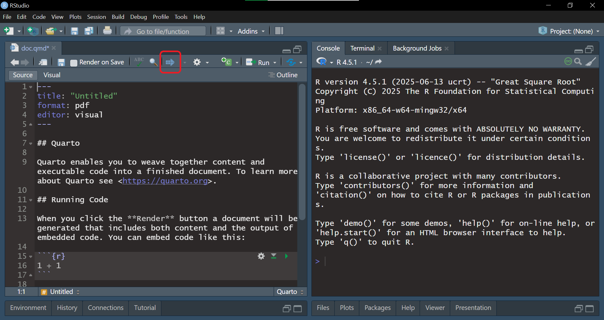
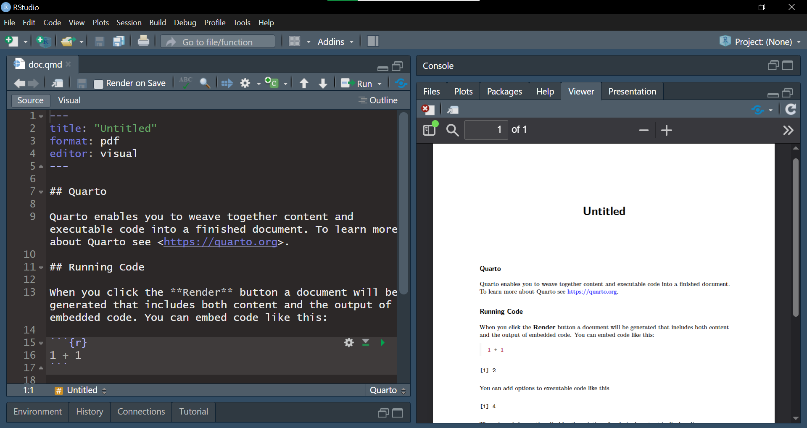

# Rendering Quarto PDFs with Tinytex


## Rendering PDFs in Quarto

In order to create PDFs with quarto, we need to have a LaTeX installation on our computer. LaTeX is a type of programming language used for typesetting pdf documents. The easiest way to get this working for Quarto is by installing a peice of software called ['Tinytex'](https://yihui.org/tinytex/), which is a lighweight version of LaTeX.


## Method 1 - Install via the tinytex R package


Open Rstudio, and run the code below in the console to install the [tinytex](https://cran.r-project.org/web/packages/tinytex/index.html) R package
```{r}
#| eval: FALSE
install.packages("tinytex")

```

Once the package is installed, run this code in the console
```{r}
#| eval: FALSE
tinytex::install_tinytex()

```

This will download tinytex and install it on your computer. Once the installation is complete, you should now be able to render pdf files in Quarto.


## Method 2 - Install tinytex via Terminal in RStudio

If you have any issues with the first method, an alternative way of installing tinytex is by using the terminal within RStudio.


### Step 1 {.unnumbered}

Open RStudio, and click the 'Terminal' tab in the console window.

{fig-align="center"}

### Step 2 {.unnumbered}

You should see a window that looks like this, with a flashing cursor (the filepath that is shown here will be different on your computer).

{fig-align="center"}

### Step 3 {.unnumbered}

Type 'quarto install tinytex' and press enter.

{fig-align="center"}

### Step 4 {.unnumbered}

Tinytex will then download and install to your computer. Once complete, you can now render pdf files in quarto.

{fig-align="center"}

### Step 5 {.unnumbered}

If the file renders correctly, it should look something like this.

{fig-align="center"}


We can now create pdf files with Quarto!